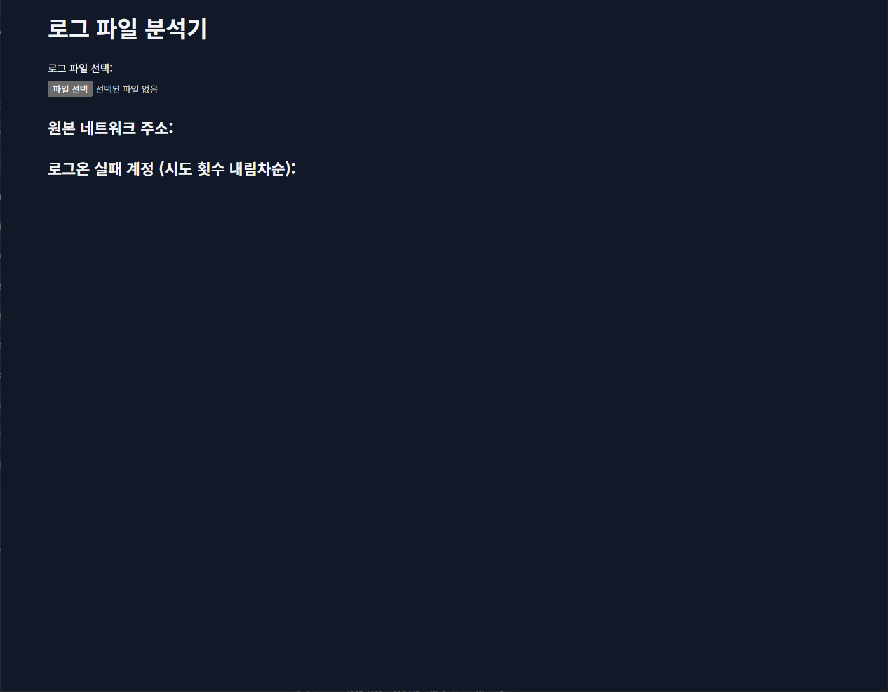
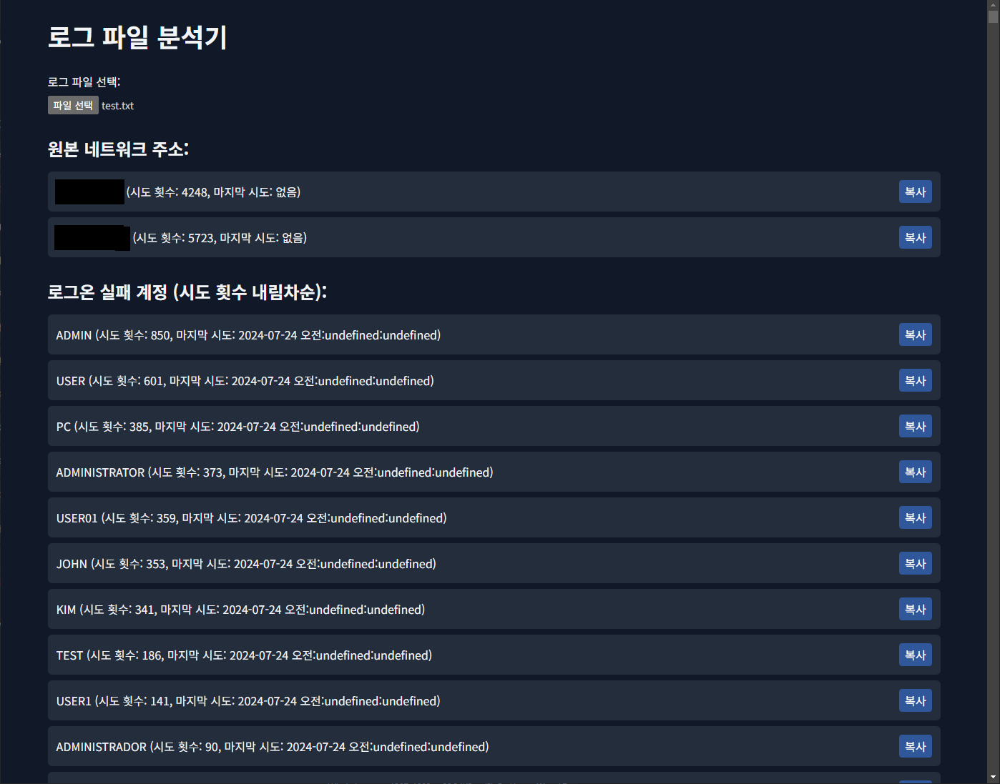

# Windows Event Viewer Log Filter

## Introduction

이 프로그램은 윈도우 이벤트 뷰어 로그를 분석하여 특정 이벤트를 필터링하는 프로그램입니다.

해당 프로그램을 이용해 원격접속시 타 ip로부터 온 이벤트 로그를 쉽게 분석하여 ip, 로그온에 실패한 사용자명을 확인할 수 있습니다.

This program analyzes Windows Event Viewer logs and filters out specific events.

You can easily analyze event logs from other IPs when connecting remotely and check the IP and the username of the user who failed to log on.

## Usage

1. Clone the repository

    ```bash
    git clone https://github.com/siejwkaodj/window-eventvwr-logviewer.git
    ```

2. open index.html
3. upload your event log file (.txt)
4. see the result

## Screenshots

- program start screen


- event filtered result

